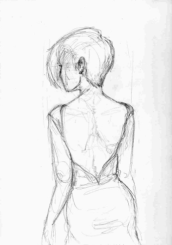

# Backless
Some text editors have a mode which disables the backspace key: it usually called Typerwriter Mode, or Productivity Mode, or Hemingway Mode. **Backless** is the same idea, but globally. 

### Backless disables:

<kbd>backspace</kbd>

<kbd>Del</kbd>

<kbd>Home</kbd>

<kbd>PgUp</kbd>

<kbd>Up</kbd><kbd>Down</kbd><kbd>Left</kbd><kbd>Right</kbd>

### Requirements
* AutoHotKey

### Usage
1. Downlad and run
2. F12 Quits

image by [Melissa Beth Rose](https://melissabethrose.com/)

### Tested On
Windows 7 32bit and AutoHotKey 1.1.22.07